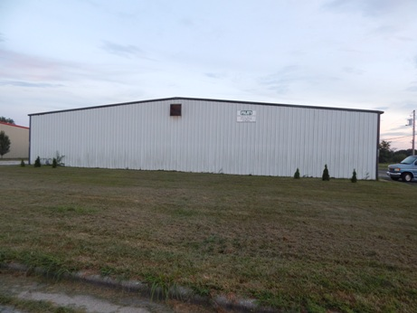

Applied Urethane Technology Inc. (AUTI) is a manufacturer of quality Cast Urethane Products. AUTI designs custom molded, castable Urethane products for multiple industries. In addition, we specifically formulate products to meet exact requirements; any size, shape or color, 20A-80D.

We specialize in the manufacturing of custom molded urethane parts for: Material Handling Equipment, Business Machinery, Printing Equipment, Rollers, Mail Sorting Machinery, Medical Equipment, Noise Abatement Gears, Elevator and Escalator components, Power Transmission Couplings, Bumpers, Waste Water Treatment components. We also specialize in: F.D.A. Materials, Mil-Spec. Defense Work, and Short Run to High Run Volume Production.

We manufacture polyurethane parts for both U.S. and [International Customers](international).

[Click here for more information about our products & services](products-and-services)

Please visit our new Domain at: [DriveRoller.com](urethane-drive-rollers) to view in depth the many different types of Urethane Drive Rollers that we manufacture.

Please click here to view: [Friends and Associates of AUTI](friends-and-associates) Please click here to view: [Urethane & Polyurethane Industry Related Listings](urethane-industry-links)