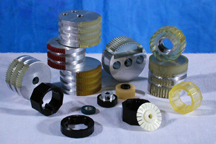

Please click [HERE](img/eBanking_6.jpg) for a Larger View.

Please click [HERE](img/Rollers432x288.jpg) for a Larger View.

Here at AUTI we specialize in the engineering, and manufacturing of various polyurethane ATM, and Banking Machine Parts. Listed below are some of the various Banking Machines that we create parts for:

- ATM's
- Check Processing Equipment
- Bill/Coin Counting Machinery
- OCR Equipment
- Document Processing Centers

We can replace hard to find discontinued, and overpriced rollers with Applied Urethane's quality urethane rollers.

___

#### The Benefits of using Urethane in ATM Machines, and in Banking Machines include:

- Reduced Down Time
- Reduced Maintenance Costs
- Noise Abatement
- Non Marking

Let our staff help you design your best machine.
