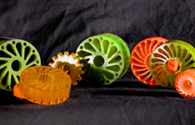

A simple variable Pinch Roller:

Replace your pivot, lever, and spring mechanism with AUTI’s Compliant Rollers. Our Compliant Roller on a simple stud will conform to your uneven product flow. We can change the spring rate simply by changing the hardness.

Our Polyurethane Compliant Rollers reduce the complexity and space required by the old lever system. These rollers are in used in Document Handling Equipment such as Mail Handling Machinery, Material Handling Equipment, and for other types of machinery in many different kinds of industries including yours.

Please click [HERE](img/set6.jpg) for a Larger View.

Compliant Rollers are sometimes referred to as a No Crush Roller, a Zero Crush Roller, or a Compliance Roller.

Visit the [Applied Urethane Technology, Inc. Store](store) to purchase Replacement Rollers for Pitney Bowes Machines.

Compliant Rollers that use Polyurethane have the following characteristics:

- High Quality
- Durable
- Resilient
- Excellent Shock Absorption
- Reduced Space Needed
- Reduced Complexity
- Simpler to Maintain
- Less Expensive Assembly
- High Rebound
- Dimensional Stability
- Abrasion Resistant
- Reduced Down Time
- Reduced Maintenance Costs

Please [Click Here](urethane-drive-rollers) for more information about other Urethane Rollers that we manufacture including Drive Rollers, Idler Rollers, Friction Rollers, Pinch Rollers, Hard Segment/Soft Segment Rollers, and other types of Roller Products.
