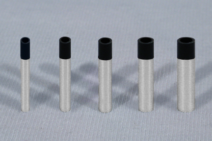

We have a wide variety of Engineering Assistance Capabilities here at AUTI. Please contact us to see how we can improve your business through our Engineering Assistance Staff.

#### Engraved Wheels

#### Crowned Wheels

We can engrave wheels, and rollers to meet your specifications. In the picture above you can see wheels engraved with instructions and contact information.

#### Potting Compounds

We create, and engineer potting compounds for many different applications. Our polyurethane Potting Compounds will protect your Electronic Components from harsh environments.

#### Robotic Fingers and Robotic Parts

We produce Robotic Fingers, and other Robotic Parts for Hi-Tech Companies. Robotic Parts that use Urethane will outlast other comparable compounds.
Please click on the charts below for a performance comparison between Urethane, and other products including rubber. You will see that Urethane beats the competition hands down.

[Performance Comparison](performance-comparison)

[Soft Material Specifications](soft-sheet-materials)

[Medium Material Specifications](medium-material-specs)

[Hard Material Specifications](hard-material-specs)

[FDA Food Handling Specifications](fda-specs)

[Glossary of Urethane, and Polyurethane Related Terms](glossary)

The types of Urethane we process include: Aliphatic, TDI, MDI, PPDI, Polyester, and Polyether.