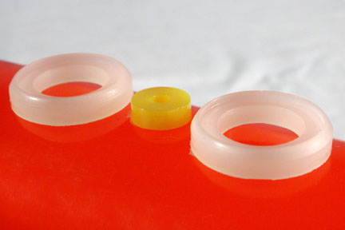

*Use of Polyurethane Elastomers for Dry Food Handling, as per FDA Regulations:*

For Dry Food Approval all urethane components must be listed in Section #177.1680 of the FDA Register. In addition, the urethane from these components must be capable of passing Federal Test Method 6191, Number 141 for abrasion resistance.

With the exception of PPDI based prepolymers, all Chemtura Adiprene and Vibrathane prepolymer components and Royalcast© 3101, 3105, 3109 Part A components are approved for dry food use. Urethane systems, however, are limited because many common curatives do not have approval. The table below lists the common curatives and classifies them according to whether they have approval or not.

The following curative products meet FDA dry food handling regulations for chemical composition:

- 1, 4 Butanediol
- 1, 3 Butanediol
- Trimethylolpropane (TMP)
- HQEE
- Perstorp TP30LW
- Vibracure© A 120
- Vibracure© A 122
- Vibracure© A 125
- Triethanolamine
- Royalcast© 3101 B-60
- Methylenedianiline (MDA)
- Versalink 740M
- Vibracure© A 157

The following products do not meet FDA dry food handling regulations for chemical composition:

- MBCA
- Vibracure© A 931
- TIPA
- Curene© 3005
- Curene© 155, 148
- Caytur© 21
- Caytur© 31
- Ethacure© 300
- Ethacure© 100
- Royalcast© 3101 B

Use of Polyurethane Elastomers for Aqueous and Fatty Food Handling, as per FDA Regulations:

Durathane SMS-F60 and SMS-F95 prepolymers meet the definition of acceptable polyurethane resins for repeated use in contact with food under Section 121.2562, Subpart F, Food Additives Reguations. This regulation allows the use of polyurethane resins derived from reactions of MDI, adipic acid and1,4 butanediol in contact with dry, aqueous, and fatty foods.

Durathane SMS-F60 and SMS-F95 prepolymers, when cured with Vesalink 1,4 BDO curative, have been FDA approved for repeated use in contact with dry, aqueous and fatty foods under Code of Federal Register, Title 21, Part 177, Subpart C, Section 177.2600.

*Source: Air Products ®*

### AUTI manufactures FDA Approved 

#### Polyurethane Seals & Components

We manufacture high quality urethane seals, beaters, clamps, belts, and other urethane Food Processing parts and components for the Food Processing Industry. We meet Wet and Dry FDA Regulations for Direct Food Contact. We manufacture urethane parts for Food Processing Equipment that meet FDA Regulations, also.

For Product Details of our high quality Urethane Products, please [Click Here](products-and-services).  

[Go back to Engineering Assistance](engineering-assistance)

