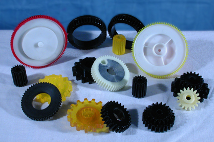
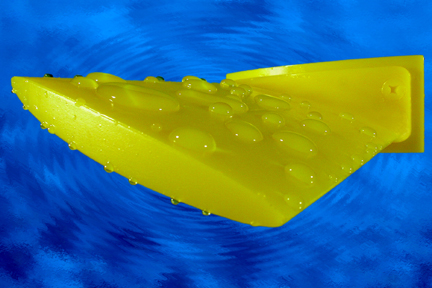

### Custom Molded Cast Urethane Parts for General Industry

Listed below are just a few of the many custom molded urethane parts that we manufacture for various industries:

- Custom Molded, Castable Urethane Components for Mechanical Applications

Please click [HERE]({{site.url}}/img/eGEARS.jpg) for a Larger View.

- Wear Resistant, High Strength Elastomer; Specifically formulated to meet exact requirements; 30A-75D.
- Prototyping to Production.
- Custom Molded parts for: Material Handling Equipment, Business Machinery, Printing Equipment, Rollers, Mail Sorting Machinery, Medical Equipment, Noise Abatement Gears, and Bumpers.
- F.D.A. Materials, Mil-Spec. Defense work, Short run to high volume production.

Please click [HERE]({{site.url}}/img/FIN6X4.jpg) for a Larger View.