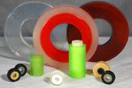
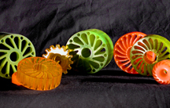

We make rollers with a hard Urethane Core that has a softer compound on the outside diameter. This is more cost efficient compared to making metal cores. Other advantages include: Environmental Resistance (acid, salt water) and easy assembly.

Please click [HERE](img/SOFT6.jpg) for a Larger View.

We produce both Custom Made Segmented Rollers and Segmented Wheels for various industries.

We manufacture [Compliant Rollers](compliant-rollers) and Crush Rollers of various sizes, and hardness's.

Please click [HERE](img/set6.jpg) for a Larger View.

[Contact us](contact-us) and we will send you a Free Sample of this product.

To view other types of rollers that we manufacture including Urethane Drive Rollers, please click [HERE](urethane-drive-rollers)
