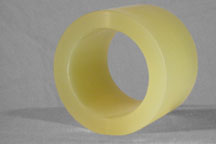
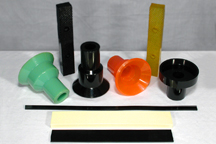
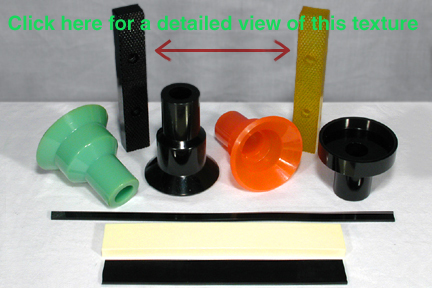

Here at Applied Urethane Technology, we specialize in the production of Urethane Parts to help you meet your Material Handling Equipment Production needs.

Here are just a few Material Handling Equipment Parts that we specialize in manufacturing: Urethane Rollers, Polyurethane Clamps, Diverters, Wheels, and parts used for Conveyor Equipment.

#### Dry Wall Rollers

Please click [HERE](img/drywallcreasersleeve6.jpg) for a Larger View.

#### Urethane Clamps

Please click [HERE](img/Clamps3_1.jpg) for a Larger View.

At AUTI, we produce many different kinds of clamps. Below is a picture that shows our ability to produce urethane clamps of different textures.

Please click [HERE](img/ClampTexture6.jpg) for a Detailed View.

#### Benefits of using Polyurethane in Material Handling Situations:

- Minimal Tooling Cost
- Excellent Load-Bearing Capacity
- Excellent Impact Resistance
- Excellent Noise Abatement
- Exceptional Efficiency
- Dimensional Stability
- Extended Field Wear
- Reduced Down Time
- Reduced Maintenance Costs

Small part and small runs are our specialty.
