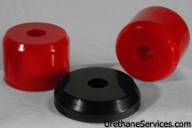
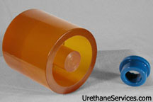
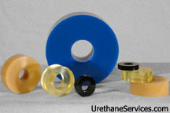

Urethane Bushings outlast competing materials including plastic and rubber in many applications. Please Contact us to see if our Polyurethane is best suited to meet your Bushing Applications needs.

##### Urethane Cement Bushings

Please click [HERE](img/CementFormBushings6.jpg) for a Larger View.

##### Polyurethane Suspension Bushings

Please click [HERE](img/SuspensionBushing6.jpg) for a Larger View.

Various Isolation Bushings

 
Please click [HERE](img/IsolationBushing6.jpg) for a Larger View.

In the pictures above, you can view a few of the many types of Polyurethane Bushing Products that we have manufactured for our customers.