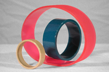

#### Various Drive Belts

AUTI manufactures urethane belting that will keep your Equipment performing at maximum efficiency.

We design new applications, and retrofits for your existing machinery.

At AUTI we will analyze your Polyurethane Belting needs for such factors as the machine design, materials, and operating conditions. After evaluating your information, we can recommend materials and contours to assure you of the right belting for your application.

We manufacture High Quality Precision Non-Reinforced Urethane Drive Belts.

#### Cleated Urethane Belts

Please click [HERE](img/tread6.jpg) for a Larger View.

To view the Tread and Textures of various Cleated Urethane Belts we offer, please click HERE
Having trouble getting OEM Belts? AUTI can solve your sourcing needs.

We can manufacture high quality precision Document Transfer Belts for your Business Equipment.

#### Polyurethane O-Rings

 

Please click [HERE](img/orings6.jpg) for a Larger View.

We manufacture urethane O-Rings that can be used as drive belts.

Having trouble with your present O Ring Supplier? Contact us, and we will custom design, and formulate your urethane O Ring to exceed your Applications.

Typically, our polyurethane O-Rings will outlast Rubber O-Rings.

[Contact us](contact-us) and we will send you a Free Sample of the products listed above.