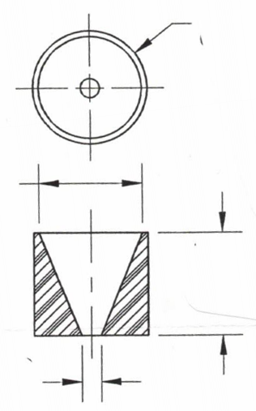

### CHOOSING THE BEST URETHANE FOR YOUR APPLICATION FOR AUTOMATIC CAPPING MACHINES

45A Hardness, Green
45A is the softest, highest coefficient of friction urethane
Used on hard to grip caps but typically wears faster.

60A Hardness, Clear
60A is the most popular polyurethane, about the hardness of a pencil eraser.
Works best in most applications.

70A Hardness, Orange70A
70A is for heavy duty, high wear applications

80A Hardness, Blue
This is the most durable urethane. It can be the best choice in some applications.

___

### Choosing the right inserts and liners 

Your chuck/ shell should have a number on it that corresponds with the numbers in the chart.
#25 chuck uses a #25 insert, liner
If there is not a number, measure the inside dimension of the chuck, shell.
On the price chart, there is a column labeled outside dimension.
The outside dimension of the insert, liner is slightly larger than the inside dimension of the chuck, shell.

If you have any questions, we are here to help.

$100. Minimum
<a href="contact-us" class="btn btn-primary">Contact Us</a>

### OTHER PARTS FOR YOUR PACKAGING MACHINES

Applied Urethane also makes  urethane parts for other types  of packaging machinery
We manufacture gripper pads, gripper tips, clamps, drive rollers, idler rollers, bearing covers, 
Quiet gears,  drive rollers. Parts you want to work better and last longer.  

60A Polyurethane, other hardnesses are available. 40% Discount for orders of 100 pieces or more of each part. 20% Discount for orders of 50 to 99 pieces of each part. Contact us for more information. Capper Insert sizes listed above are in the Industry Standard Cap Size of millimeters (mm).

Minimum of $100 per order is required.

<i class="fa fa-print"></i> Print Capper Inserts Chart For a printer friendly version of this price chart, please <a href="javascript: window.print()">click here</a>

Please click <a href="img/6BC2.jpg">HERE</a> for a Larger View. In the picture, you can see the various sizes of polyurethane bottle capping inserts that we produce measured against the scale of a 6 inch ruler:

We also specialize in production of Bottle Cap Clamps.

    

Please contact us for pricing with your measurements, and specifications if your the size is not listed on the table on the previous page.

