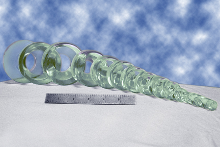
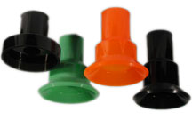
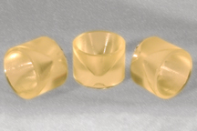

60A Polyurethane, other hardnesses are available. 40% Discount for orders of 100 pieces or more of each part. 20% Discount for orders of 50 to 99 pieces of each part. Contact us for more information. Capper Insert sizes listed above are in the Industry Standard Cap Size of millimeters (mm).

Minimum of $100 per order is required.

<i class="fa fa-print"></i> Print Capper Inserts Chart For a printer friendly version of this price chart, please <a href="javascript: window.print()">click here</a>

Please click <a href="img/6BC2.jpg">HERE</a> for a Larger View. In the picture, you can see the various sizes of polyurethane bottle capping inserts that we produce measured against the scale of a 6 inch ruler:

We also specialize in production of Bottle Cap Clamps.

    

Please contact us for pricing with your measurements, and specifications if your the size is not listed on the table on the previous page.

