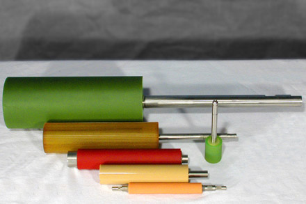
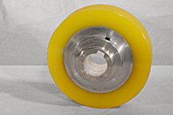
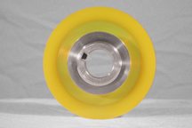
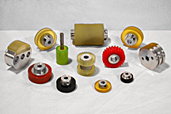
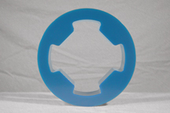

Please click [HERE](img/ROLLERS6_1.jpg) for a Larger View.

#### Long Lasting Urethane Rollers

AUTI is a leading manufacturer of high quality, and long lasting urethane rollers. We offer High Grip (high co-efficient of friction) rollers with a precision ground to drive your products.

Polyurethane Rollers that we manufacture include:

- Idler Rollers
- Drive Rollers
- Pull Rollers
- Spline Rollers
- Capstan Rollers
- Transfer Rollers
- Index Rollers
- Friction Rollers
- Feed Rollers
- Pinch Rollers
- Pick Rollers
- [Compliant Rollers](compliant-rollers)
- [Hard/Soft Segment Rollers](hard-and-soft-segment-rollers)
- [Urethane Bonded to Metal](/)
  	
Drive Rollers for the
Drive Rollers for the Document Transferring Industry
Document Transferring Industry

Hard/Soft Segment Rollers
 Hard/Soft Segment Rollers

To see a few pictures of other types of Urethane Drive Rollers in this category that we manufacture including Polyurethane Bonded to Metal, please click [HERE](urethane-drive-rollers)
A Drive Roller that uses Polyurethane has the following characteristics:

- High Quality
- Durable
- Resilient
- Excellent Shock Absorption
- High Load-Bearing
- High Rebound
- Dimensional Stability
- Abrasion Resistant
- Reduced Down Time
- Reduced Maintenance Costs

### Other Polyurethane Drive Rollers

These are just a few of the many different types of Custom Molded Urethane Drive Rollers that we manufacture. To view the Main Polyurethane Drive Roller Page, please click [HERE](urethane-drive-rollers)

#### Urethane Bonded to Metal Rollers

Please click [HERE](img/urethane_bonded_to_metal.jpg) for a Larger View.

Please click [HERE](img/urethane_bonded_to_metal_roller.jpg) for a Larger View.

AUTI produces many different types of polyurethane rollers including drive rollers with urethane bonded to metals such as steel. Please contact us to let us show you how we can meet your urethane to metal bonding applications needs.

Please click [HERE](img/Rollers432x288.jpg) for a Larger View.

Please click [HERE](img/BU6.jpg) for a Larger View.

Please click [HERE](img/set6.jpg) for a Larger View.
