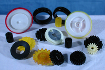

Please click [HERE](img/GEAR6.jpg) for a Larger View.

AUTI will custom mold your gears to help you to meet your exact needs. In many cases, we can mold off of an existing gear. This allows AUTI to make a prototype polyurethane gear for you both fast, and economically.

#### Our Urethane performs excellent under harsh conditions:

In one instance, AUTI replaced steel gears in an irrigation spray head with our urethane gears. The customer wanted a material that could withstand dirt, sand, and wide temperature ranges. The customer also wanted a material that could be maintenance free for years. Our engineers came up with a urethane elastomer that was able to run dry. This enabled the customer to assemble the head without using grease, which attracts sand and grit. The sand, and grit was the main culprit that was destroying the steel gears. With our product their spray heads required no maintenance for several years, as opposed to a couple rebuilds per year with the original steel gears.

Please click [HERE](img/eGEARS.jpg) for a Larger View.

#### Our Urethane can Help to Protect your Machinery:

With some machinery, if there is a jam-up, the machinery can be destroyed as well as the product that is in process. We can make our polyurethane gears so that if there is a jam-up in the machinery, the urethane gear will give enough to prevent damage to the machine, with the added benefit of the gear itself, not being damaged as well. Once the jam-up is removed, you can restart the machine, and the urethane gear continues to operate effectively.

#### Our Urethane will help to quiet your Machinery:

If you have several gears in a row, replace every other gear with an AUTI polyurethane gear, and you will be amazed at how quiet your machines will run.

Gears that use Polyurethane have the following characteristics:

- High Noise Abatement
- Functions well in Severe Environments
- Self Lubricating
- Pre-Loaded
- Smooth Running
- High Quality
- Durable
- Resilient
- Excellent Shock Absorption
- High Rebound
- Dimensional Stability
- Abrasion Resistant
- Reduced Down Time
- Reduced Maintenance Costs
