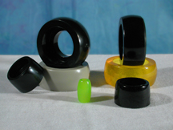
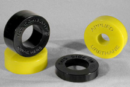
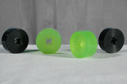
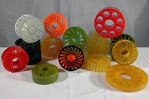

#### Wheels that outlast Rubber:

The wheels that we manufacture using polyurethane can be made to suit your needs. We can produce urethane wheels of various shapes, hardnesses, colors, and sizes. Listed below are some categories of urethane wheels that we regularly manufacture.

#### Crowned Wheels

Please click [HERE](img/CrownedRoller6_10.jpg) for a Larger View.

Crowned Wheels are generally used in Conveyors that have turns. The crown allows the wheel to turn with less noise, and resistance (lower energy cost, lower maintenance cost). We produce urethane Crowned Wheels for Belt Applications, also.

We can produce Crowned Wheels / Rollers of various hardnesses, colors, and sizes to meet your company's needs.

#### Engraved Wheels

 

Please click [HERE](img/polyurethane_engraved_wheels.jpg) for a Larger View.

We can engrave wheels, and rollers to meet your specifications. In the picture above you can see urethane wheels engraved with instructions and contact information. We can engrave part numbers on your wheels as well.

#### Deskew Wheels

Please click [HERE](img/deskew_wheels.jpg) for a Larger View.

Polyurethane Deskew Wheels are used primarily in Document Processing Equipment. They help to orient your documents for higher quality optical readings. Deskew Wheels are used in light Roller Applications. Deskew Wheels can be used as Soft Touch Wheels with variable spring rates via different urethane hardness's.

#### Drive Wheels

AUTI produces high friction materials for your drive wheels with excellent abrasion resistance: to ensure your machine will run at peak efficiencey with low maintenance cost.

#### Compliant Wheels

 

Please click [HERE](img/Compliance6.jpg) for a Larger View.

Compliant Wheels are used in applications where documents or items of varying thicknesses are being processed. Compliant Wheels with their spring like action allows your machinery to process documents with different thicknesses without complicated spring machanisms. Compliant Wheels are sometimes referred to as Zero Crush Wheels, No Crush Wheels, or Compliance Wheels.

Advantages of Urethane Compliant Wheels include:

- Simpler Machine (no springs necessary)
- Quieter Operation
- Lower Maintenance Cost

#### Wheels that use Polyurethane have the following characteristics:

- High Quality
- Durable
- Resilient
- Excellent Shock Absorption
- High Load-Bearing
- High Rebound
- Dimensional Stability
- Abrasion Resistant
- Reduced Down Time
- Reduced Maintenance Costs
